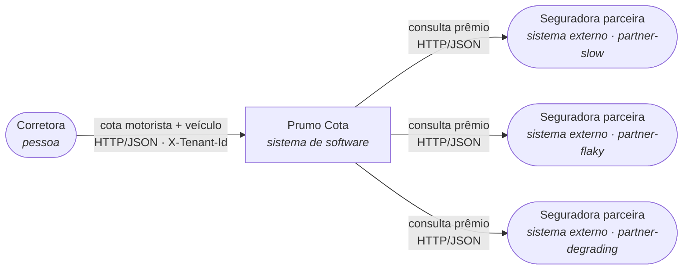
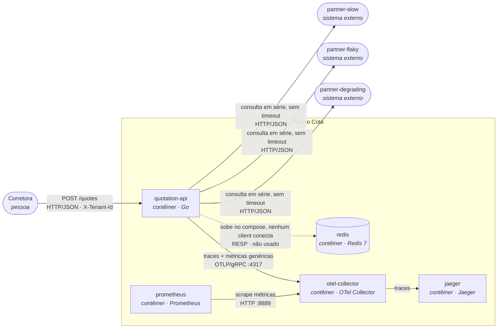
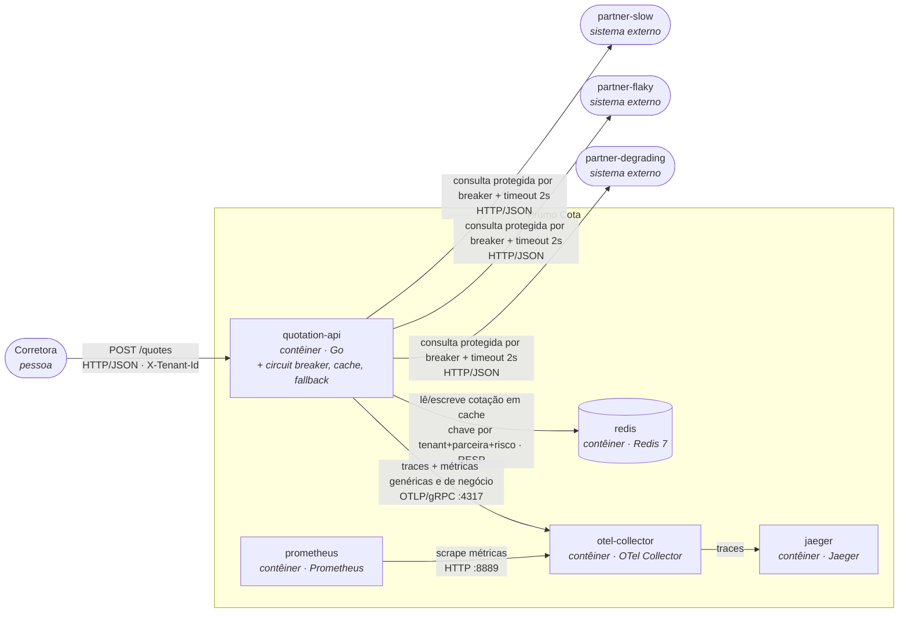
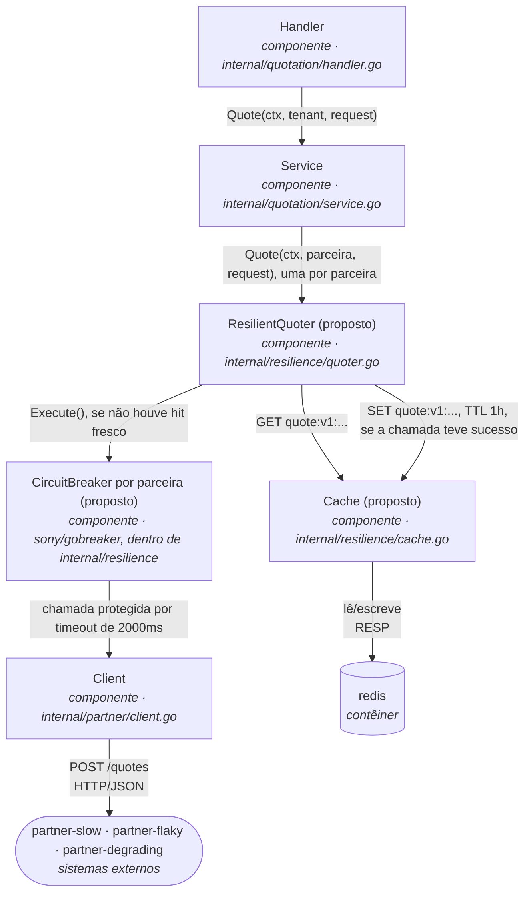

# SAD: Prumo Cota (plataforma de cotação de seguro auto)

## 1. Introdução


## 2. Visão geral da arquitetura

### Nível 1: Contexto (vale para o antes e o depois: a fronteira com o mundo não muda)



A Prumo intermedeia três seguradoras e devolve a lista ordenada por prêmio; ela não precifica risco
nem emite apólice (os motores de precificação são das seguradoras, fora da fronteira deste SAD).

### Nível 2: Contêiner, ANTES



Uma falha em qualquer parceira aborta a requisição inteira (`internal/quotation/service.go`), e o
tempo de resposta é a soma das três chamadas sequenciais, sem teto (`internal/partner/client.go`, sem
`Timeout`).

### Nível 2: Contêiner, DEPOIS



### O delta

- **Acrescenta:** uso efetivo do `redis` (já subia ocioso no compose) como cache de cotação por
  parceira; timeout de 2000ms e circuit breaker por parceira (`sony/gobreaker`, 5 falhas consecutivas)
  na chamada de `internal/partner/client.go`; fallback de resposta parcial com complemento de cotação
  anterior de cache quando uma parceira falha ou está com o circuito aberto; três métricas de negócio
  e duas marcações de trace novas, exportadas ao mesmo `otel-collector` que já está de pé.
- **Muda de lugar:** nada muda de contêiner (os mesmos oito serviços do `docker-compose.yml`
  continuam existindo com o mesmo papel). Toda a diferença fica dentro do processo `quotation-api`
  (o cliente HTTP decorado) e no `redis`, que passa de ocioso a consumido.
- **Sai:** nada sai. O contrato de sucesso de `POST /quotes` é estendido (não substituído) para
  carregar a marcação de degradação que o fallback introduz (ver seção 4).

**A quem esta arquitetura serve:** para a corretora, o delta é a diferença entre um 502 quando
qualquer parceira tropeça e uma cotação parcial ou levemente desatualizada, mas utilizável, na maioria
das vezes em que isso acontece; para quem opera a plataforma às 3h da manhã, é ter um estado de
circuito e um hit rate para olhar antes de um cliente ligar reclamando; para o encarregado de dados, é
a garantia de que a cotação servida de cache ou de fallback continua isolada por corretora e
rastreável até a consulta que a originou.

## 3. Requisitos funcionais e não funcionais

### Requisitos funcionais

Do contrato que já existe hoje (`internal/quotation/handler.go`, `internal/quotation/service.go`):

- **RF-01.** `POST /quotes` exige o cabeçalho `X-Tenant-Id`; sem ele, a resposta é `400` com
  `{"error":"X-Tenant-Id is required"}`.
- **RF-02.** Uma corretora fora da lista configurada em `TENANTS` recebe `403` com
  `{"error":"broker not enabled on this platform"}`.
- **RF-03.** A resposta de sucesso agrega as cotações das três parceiras, ordenadas por
  `premium_cents` crescente.
- **RF-04.** Toda cotação apresentada ao consumidor, inclusive a servida de cache ou de fallback,
  permanece rastreável até a consulta que a originou, atendendo à exigência de auditoria de cinco
  anos da SUSEP.

Criados por esta arquitetura:

- **RF-05.** Quando uma parceira falha ou está com o circuito aberto, a resposta entrega as cotações
  das parceiras que responderam, sinalizando explicitamente qual parceira está ausente, em vez de
  abortar a requisição inteira.
- **RF-06.** Quando existe, em cache e dentro do TTL vigente, uma cotação da parceira ausente, ela é
  incluída na resposta marcada como proveniente de cache, com a idade dela; se não existir, a resposta
  segue só com as parceiras que responderam.
- **RF-07.** A chave de cache identifica univocamente a corretora (`tenant_id`); nenhuma corretora
  recebe, em nenhuma circunstância, uma cotação em cache originada por outra corretora.

### Requisitos não funcionais

| ID     | Requisito                                  | Métrica                                                                       | Hoje                                                                                                                                             | Alvo                                                                            | Como medir                                                                   | Por que este número                                                                                                                                                                                                                                                                            |
|--------|--------------------------------------------|-------------------------------------------------------------------------------|--------------------------------------------------------------------------------------------------------------------------------------------------|---------------------------------------------------------------------------------|------------------------------------------------------------------------------|------------------------------------------------------------------------------------------------------------------------------------------------------------------------------------------------------------------------------------------------------------------------------------------------|
| RNF-01 | Latência da cotação                        | p95 do `POST /quotes`                                                         | 8,00 s sob carga (baseline 2,03 s), medido em 2026-08-30 (`docs/evidencias/historico-reproduce.md`)                                              | ≤ 4 s sob a mesma carga                                                         | `http_server_request_duration_seconds`                                       | Agregação continua em série (paralelizar é opcional e fora desta entrega); com timeout de 2000 ms por parceira, o pior caso plausível é `partner-slow` (≈1,7 s) mais `partner-flaky` (≈0,2 s) mais `partner-degrading` no teto do timeout (2 s), aproximadamente 3,9 s, com margem até 4 s     |
| RNF-02 | Disponibilidade percebida pela corretora   | proporção de respostas não-502 sobre o total                                  | 60% sob carga (baseline 50%), medido em 2026-08-30                                                                                               | ≥ 98%                                                                           | `http_server_request_duration_seconds_count` por `http.response.status_code` | `partner-slow` e `partner-degrading` nunca falham; só `partner-flaky` falha (40%). Com o fallback (RF-05/RF-06) entregando resposta parcial sempre que ao menos uma parceira responde, só há falha total se as três estiverem indisponíveis ao mesmo tempo, cenário raro nos perfis do compose |
| RNF-03 | Tempo de detecção de uma parceira instável | número de falhas consecutivas até a transição fechado para aberto do circuito | não aplicável (não existe circuito hoje; cada falha chega inteira até a corretora)                                                               | circuito abre em até 5 falhas consecutivas por parceira                         | contador de transições de estado do breaker (nome definido na seção 4)       | a rajada real de 9 falhas consecutivas da `partner-flaky` (sequências 49 a 57, seed determinística) mostra que um limiar de 5 é atingido dentro da mesma rajada, sem depender de uma parceira artificialmente ruim                                                                             |
| RNF-04 | Economia de consultas compradas via cache  | hit rate do cache (hit sobre hit mais miss)                                   | 0% (Redis sobe no compose, mas nenhum client conecta; `internal/quotation/service.go` não o usa)                                                 | curva de hit rate visivelmente crescente sob a carga padrão do `make reproduce` | consulta PromQL sobre o contador de hit/miss (nome definido na seção 4)      | o objetivo aqui é provar que o mecanismo funciona; o hit rate de produção que sustenta a economia financeira é tratado à parte na seção 8, porque a carga padrão repete cinco cotações e não representa tráfego real                                                                           |
| RNF-05 | Ausência de dado pessoal em telemetria     | contagem de spans e métricas de negócio com atributo CPF, placa ou `quote_id` | 0 (a telemetria genérica atual, HTTP de entrada e saída, runtime do Go, não carrega esses campos; conferido em `internal/platform/telemetry.go`) | 0, sempre                                                                       | inspeção dos atributos declarados no código antes de cada release            | requisito regulatório da LGPD, não meta de engenharia negociável                                                                                                                                                                                                                               |

## 4. Detalhamento da arquitetura

Os três mecanismos abaixo vivem na fronteira já identificada no README: `internal/partner/client.go`
(onde nasce a proteção da chamada) e `internal/quotation/service.go` (onde a resposta é montada). Os
arquivos novos citados nesta seção (`internal/resilience/quoter.go`, `internal/resilience/cache.go`)
são **proposta**, ainda não existem no repositório; nascem na Entrega 2, sob o desenho fixado aqui.

### Decisão 1: circuit breaker

**Contexto.** `internal/partner/client.go` chama cada parceira sem timeout e sem nenhuma proteção; a
falha de uma delas aborta a requisição inteira (`internal/quotation/service.go`). A `partner-flaky`
tem uma rajada real de 9 falhas consecutivas nas sequências 49 a 57 (seed determinística `20260729`,
travada por `cmd/partner-mock/feasibility_test.go`), sempre no mesmo lugar. A `partner-degrading`
nunca falha, só afunda (acima de 5 chamadas simultâneas, 300 ms por chamada extra, teto de 6000 ms):
um breaker que só conta erro nunca abre para ela, então o timeout precisa contar como falha.

**Opções consideradas.**
- Limiar de N falhas consecutivas por parceira, sem janela de tempo. Reage rápido, mas um N pequeno
  fica sensível a uma falha isolada dentro de tráfego normal.
- Taxa de falha em janela deslizante (por exemplo, 50% em 10 requisições). Mais estável contra
  ruído, mas reage mais devagar (na simulação contra os mesmos 210 pedidos do `make reproduce`, abre
  só na requisição 10 a 55, dependendo da janela).
- Escopo global, um único circuito para as três parceiras. Descartada: uma parceira ruim derrubaria
  as outras duas saudáveis, e no cenário de agregador de fornecedores independentes isso não faz
  sentido de negócio.
- Escopo por par (parceira, corretora). Descartada para esta entrega: com duas corretoras no compose,
  a granularidade extra não se justifica e multiplica os estados a observar sem benefício claro.

**Escolha.** Um circuito por parceira (`sony/gobreaker` v2, que expõe `StateClosed`, `StateOpen` e
`StateHalfOpen` nomeados na própria API), com os parâmetros:

| Parâmetro | Valor | Por quê |
|---|---|---|
| Limiar de abertura | 5 falhas consecutivas | Na simulação contra os 210 pedidos do `make reproduce` (`cmd/partner-mock/feasibility_test.go`), esse limiar abre na requisição 42 e permanece estável (7 aberturas, 2 recuperações), contra 13 aberturas e 4 recuperações de um limiar de 3, que reage rápido mas oscila mais |
| Timeout por chamada | 2000 ms | Cobre a `partner-slow` (1500 ms mais até 200 ms de jitter) com folga, e corta a `partner-degrading` bem antes do teto de 6000 ms dela |
| Timeout conta como falha | sim | É o que faz a lentidão da `partner-degrading` virar sinal para o contador; sem isso, ela nunca abriria o próprio circuito |
| Tempo aberto até permitir teste | 5 s | Suficiente para uma rajada de falhas conhecida da `partner-flaky` (9 falhas em cerca de 1,5 s de tempo real) terminar, e para o volume em voo da `partner-degrading` drenar (cada chamada presa dura no máximo os 2000 ms do timeout) |
| Requisições permitidas no meio aberto | 2, ambas precisam ter sucesso para fechar | Uma falha entre as duas reabre o circuito imediatamente; exigir duas evita fechar de novo com base em um único sucesso de sorte |

**Consequências, inclusive as ruins.** Um limiar de 5 falhas consecutivas é mais lento a reagir que um
de 3: até quatro respostas ruins chegam à corretora antes do circuito abrir. O escopo por parceira não
protege uma corretora específica que, por acaso, concentre mais falhas que outra (fica declarado como
limite conhecido, adiante). E o circuito vive na memória do processo `quotation-api`: cada réplica
aprende sozinha que uma parceira caiu, sem estado compartilhado (segundo limite conhecido, adiante).

### Decisão 2: cache

**Contexto.** Cada consulta a uma parceira custa R$ 0,04, e são 360 mil consultas por dia útil. As
seguradoras honram o prêmio informado por até 24 horas (o teto comercial); o campo
`valid_for_seconds` que as parceiras devolvem (`PARTNER_QUOTE_TTL_SECONDS`, 300 s por padrão) é um TTL
técnico do mock, não o teto de negócio, e os dois não podem ser confundidos. Uma chave sem `tenant_id`
é incidente de dados pessoais sob a LGPD, não otimização.

O prêmio devolvido pela parceira é gerado por hash de **todo** o corpo enviado a ela
(`cmd/partner-mock/behavior.go`, `fnv.New64a()` sobre `broker` mais `driver` mais `vehicle` mais
`coverage`): documento, ano de nascimento, placa, modelo, ano do veículo, valor segurado e cobertura
entram todos no cálculo. Uma chave de cache que capture só documento e placa devolveria, num acerto, o
prêmio de outra combinação de motorista e cobertura: teria a marca de tenant certa, mas o valor
errado.

**Opções consideradas.**
- Cache por parceira (chave inclui a parceira). Sobrevive a uma parceira fora do ar: as outras duas
  continuam servindo de cache mesmo que a terceira esteja com o circuito aberto.
- Cache da cotação agregada (as três parceiras combinadas numa única entrada). Economiza mais por
  acerto, porque um hit evita as três consultas de uma vez, mas qualquer diferença entre execuções (o
  circuito de uma parceira estar aberto numa delas, por exemplo) já invalida a entrada inteira.
- TTL igual ao `PARTNER_QUOTE_TTL_SECONDS` (300 s). Descartada: é parâmetro técnico do mock, não
  reflete nenhuma decisão de negócio sobre até quando o prêmio é honrado.
- TTL igual ao teto comercial (24 h). Descartada: qualquer imprecisão no cálculo empurra o cache a
  servir um prêmio que a seguradora já não honra mais, sem nenhuma margem de segurança.

**Escolha.** Cache por parceira, TTL de 1 hora (abaixo do teto de 24 horas, acima do TTL técnico do
mock, sob o pressuposto, a validar na seção 1, de que uma parcela relevante das recotações da mesma
venda acontece dentro dessa janela). A chave, por extenso:

```
quote:v1:{tenant_id}:{partner_name}:{sha256(document|birth_year|plate|model|year|value_cents|coverage)[:16]}
```

Onde `tenant_id` é o valor normalizado de `X-Tenant-Id`, `partner_name` é o identificador da parceira
(`partner-slow`, `partner-flaky` ou `partner-degrading`), e os sete campos entre `document` e
`coverage` são os mesmos já normalizados por `Request.Normalize()` hoje
(`internal/quotation/request.go`): documento e modelo com espaço nas pontas removido, placa em
maiúsculas e sem espaço, cobertura com o padrão `comprehensive` aplicado quando vazia. O hash é
`sha256` sobre esses sete valores concatenados por `|`, truncado aos 16 primeiros caracteres
hexadecimais.

Política de invalidação: o TTL de 1 hora, aplicado como `EXPIRE` no Redis, é a única forma de
invalidação nesta entrega (terceiro limite conhecido, adiante, é justamente este). Quando o circuito
de uma parceira abre, a entrada em cache dela (se existir e ainda dentro do TTL) não é apagada; ela
passa a ser candidata do fallback da decisão 3, marcada como originada de cache e com a idade dela
exposta na resposta. Quando o TTL expira, o Redis remove a chave sozinho; como o Redis deste ambiente
sobe sem AOF nem RDB (`docker-compose.yml`), toda cotação em cache também desaparece a cada `make
down`, o que limita, na prática, por quanto tempo um dado pessoal fica retido no cache a, no máximo,
uma hora de operação contínua.

**Consequências, inclusive as ruins.** Cache por parceira multiplica o número de chaves em uso frente
a um cache agregado, e cada chave carrega sete campos normalizados, o que exige disciplina de
normalização: duas grafias diferentes do mesmo risco (por exemplo, modelo do veículo digitado com
espaço a mais) geram um miss falso. E, como o TTL é a única forma de invalidação, uma mudança de
tabela de preços na seguradora não derruba o cache antes da hora: por até 1 hora a plataforma pode
servir um prêmio que a própria parceira já não pratica mais.

### Decisão 3: fallback

**Contexto.** Hoje, uma parceira falhando aborta a requisição inteira em `502`, descartando qualquer
resposta que as outras duas já tenham dado (`internal/quotation/service.go`). O enunciado proíbe
inventar prêmio em qualquer circunstância.

**Opções consideradas.**
- Resposta parcial pura: entrega o que respondeu, nunca usa cotação antiga.
- Cotação anterior de cache pura: sempre tenta servir do cache quando uma parceira falha, mesmo que as
  outras duas estejam saudáveis e pudessem responder na hora.
- Recusa explícita: qualquer falha de parceira devolve um erro de negócio, sem nenhuma forma de
  degradação.
- Combinação das duas primeiras. Escolhida.

**Escolha.** Para cada parceira que não responde (falhou, estourou o timeout, ou está com o circuito
aberto): se existir, no cache, uma cotação dela dentro do TTL, ela entra na resposta marcada como
originada de cache, com a idade em segundos; se não existir, essa parceira simplesmente não aparece em
`quotes`, e seu nome entra numa lista explícita de parceiras ausentes. Não há piso mínimo de parceiras
respondentes: mesmo com só uma das três disponível, a plataforma responde `200` com o que tiver, em
vez de recusar.

O contrato de `Response` (`internal/quotation/request.go`) muda para carregar essa informação. Cada
item de `quotes` ganha um campo indicando a origem (`live` ou `cache`) e, quando `cache`, a idade em
segundos; a `Response` ganha uma lista de parceiras ausentes e um indicador booleano de resposta
degradada, verdadeiro sempre que existir ao menos uma parceira ausente ou uma cotação vinda de cache.

**Consequências, inclusive as ruins.** A corretora pode receber, na mesma resposta, uma cotação fresca
de uma parceira e uma cotação de até 1 hora de outra, e precisa saber interpretar a diferença de
confiabilidade entre as duas (por isso os campos de origem e idade são obrigatórios na resposta, não
opcionais). Sem piso mínimo, é possível responder `200` com uma única cotação, o que pode não ser
suficiente para o corretor fechar a venda, mas fica documentado como escolha desta entrega e não como
comportamento não intencional. E a mudança de contrato quebra qualquer cliente que hoje dependa do
formato exato de `quotes` sem os campos novos.

### Componentes (C4 nível 3, fatia protegida)



`Service` continua responsável por agregar e ordenar; `ResilientQuoter` é o novo ponto de decisão
(cache, depois breaker, depois cliente), implementando a mesma interface `Quoter` que `Service` já
consome hoje, então `internal/quotation/service.go` não precisa mudar sua lógica de orquestração, só a
montagem da `Response` para acomodar os campos da decisão 3. `cmd/quotation-api/main.go` troca a
construção de `partner.NewClient()` isolado pela composição `resilient.New(cache, breaker, client)`.

### Limites conhecidos, não implementados nesta entrega

- **Sem limite de chamadas simultâneas por parceira.** Nada nesta entrega restringe quantas
  requisições concorrentes chegam a uma mesma parceira; sob carga alta, é o próprio comportamento da
  `partner-degrading` (que afunda acima de 5 chamadas simultâneas) que faz o timeout agir como limite
  indireto, não um controle deliberado. Gatilho: um pico de tráfego bem acima do que o `make reproduce`
  gera. Efeito na corretora: mais respostas dependendo de fallback do que o esperado, mesmo com o
  circuito ainda fechado.
- **O breaker vive na memória do processo.** Cada réplica de `quotation-api` tem seu próprio estado de
  circuito; nenhuma delas sabe que a outra já detectou uma parceira ruim. Gatilho: mais de uma réplica
  em produção. Efeito na corretora: réplicas diferentes podem responder de forma diferente para o
  mesmo risco no mesmo minuto, uma com o circuito aberto, outra ainda fechada.
- **TTL é a única forma de invalidar o cache.** Não existe invalidação ativa se a seguradora mudar a
  tabela de preços fora do ciclo normal. Gatilho: reprecificação da seguradora dentro da janela de 1
  hora do TTL. Efeito na corretora: pode receber, por até 1 hora, uma cotação em cache que a própria
  parceira já não pratica mais.
- **Uma corretora pode consumir a capacidade das outras.** O circuito é por parceira, não por par
  parceira e corretora; uma corretora que gere tráfego desproporcional para uma parceira pode abrir o
  circuito dela para todas as corretoras. Gatilho: uma corretora com volume muito maior que as demais
  batendo numa parceira já instável. Efeito na corretora: uma corretora pequena perde acesso a uma
  parceira por causa do comportamento de uma corretora grande, sem ter feito nada de diferente.

## 5. Implementação


## 6. Operação e gestão de mudanças


## 7. Recuperação de desastres


## 8. Tecnologias, custos e pessoal (TCO)


