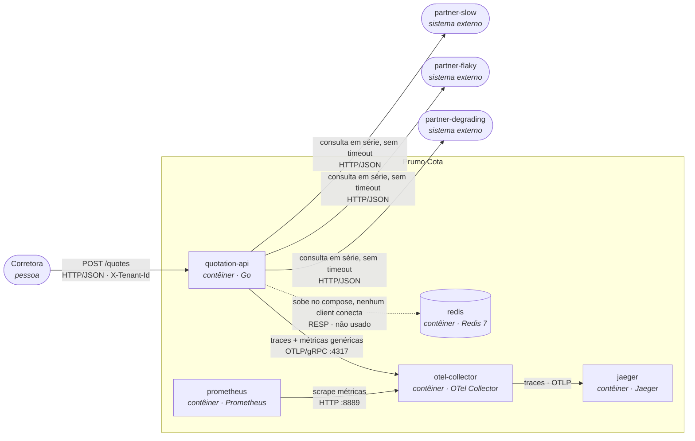
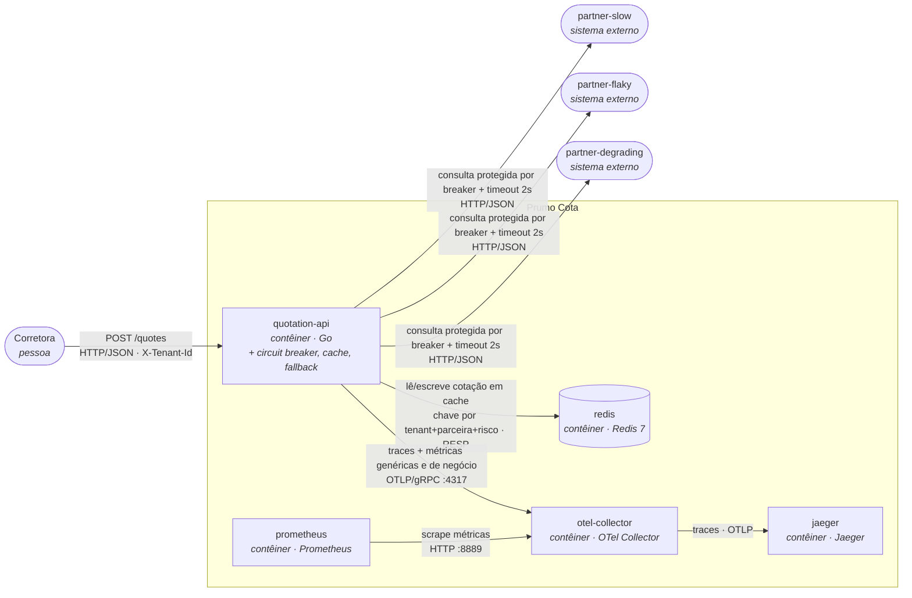
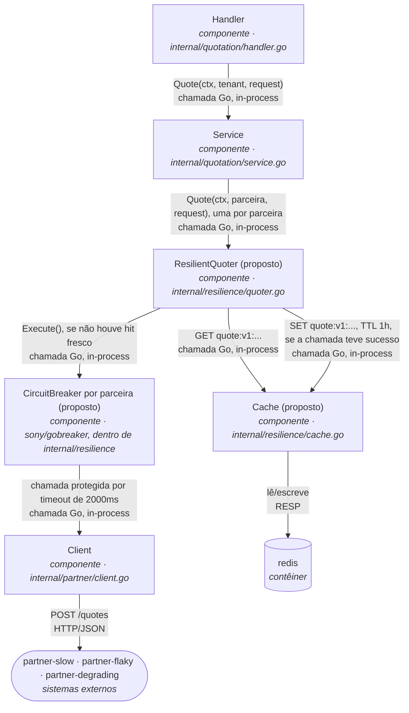

# SAD: Prumo Cota (plataforma de cotação de seguro auto)

## 1. Introdução


## 2. Visão geral da arquitetura

### Nível 1: Contexto (vale para o antes e o depois: a fronteira com o mundo não muda)


A Prumo intermedeia três seguradoras e devolve a lista ordenada por prêmio; ela não precifica risco
nem emite apólice (os motores de precificação são das seguradoras, fora da fronteira deste SAD).

### Nível 2: Contêiner, ANTES



Uma falha em qualquer parceira aborta a requisição inteira (`internal/quotation/service.go`), e o
tempo de resposta é a soma das três chamadas sequenciais, sem teto (`internal/partner/client.go`, sem
`Timeout`).

### Nível 2: Contêiner, DEPOIS



### O delta

- **Acrescenta:** uso efetivo do `redis` (já subia ocioso no compose) como cache de cotação por
  parceira; timeout de 2000ms e circuit breaker por parceira (`sony/gobreaker`, 5 falhas consecutivas)
  na chamada de `internal/partner/client.go`; fallback de resposta parcial com complemento de cotação
  anterior de cache quando uma parceira falha ou está com o circuito aberto; três métricas de negócio
  e duas marcações de trace novas, exportadas ao mesmo `otel-collector` que já está de pé.
- **Muda de lugar:** nada muda de contêiner (os mesmos oito serviços do `docker-compose.yml`
  continuam existindo com o mesmo papel). Toda a diferença fica dentro do processo `quotation-api`
  (o cliente HTTP decorado) e no `redis`, que passa de ocioso a consumido.
- **Sai:** nada sai. O contrato de sucesso de `POST /quotes` é estendido (não substituído) para
  carregar a marcação de degradação que o fallback introduz (ver seção 4).

**A quem esta arquitetura serve:** para a corretora, o delta é a diferença entre um 502 quando
qualquer parceira tropeça e uma cotação parcial ou levemente desatualizada, mas utilizável, na maioria
das vezes em que isso acontece; para quem opera a plataforma às 3h da manhã, é ter um estado de
circuito e um hit rate para olhar antes de um cliente ligar reclamando; para o encarregado de dados, é
a garantia de que a cotação servida de cache ou de fallback continua isolada por corretora e
rastreável até a consulta que a originou.

## 3. Requisitos funcionais e não funcionais

### Requisitos funcionais

Do contrato que já existe hoje (`internal/quotation/handler.go`, `internal/quotation/service.go`):

- **RF-01.** `POST /quotes` exige o cabeçalho `X-Tenant-Id`; sem ele, a resposta é `400` com
  `{"error":"X-Tenant-Id is required"}`.
- **RF-02.** Uma corretora fora da lista configurada em `TENANTS` recebe `403` com
  `{"error":"broker not enabled on this platform"}`.
- **RF-03.** A resposta de sucesso agrega as cotações das três parceiras, ordenadas por
  `premium_cents` crescente.
- **RF-04.** Toda cotação apresentada ao consumidor, inclusive a servida de cache ou de fallback,
  permanece rastreável até a consulta que a originou, atendendo à exigência de auditoria de cinco
  anos da SUSEP.

Criados por esta arquitetura:

- **RF-05.** Quando uma parceira falha ou está com o circuito aberto, a resposta entrega as cotações
  das parceiras que responderam, sinalizando explicitamente qual parceira está ausente, em vez de
  abortar a requisição inteira.
- **RF-06.** Quando existe, em cache e dentro do TTL vigente, uma cotação da parceira ausente, ela é
  incluída na resposta marcada como proveniente de cache, com a idade dela; se não existir, a resposta
  segue só com as parceiras que responderam.
- **RF-07.** A chave de cache identifica univocamente a corretora (`tenant_id`); nenhuma corretora
  recebe, em nenhuma circunstância, uma cotação em cache originada por outra corretora.

### Requisitos não funcionais

| ID     | Requisito                                  | Métrica                                                                       | Hoje                                                                                                                                             | Alvo                                                                            | Como medir                                                                   | Por que este número                                                                                                                                                                                                                                                                            |
|--------|--------------------------------------------|-------------------------------------------------------------------------------|--------------------------------------------------------------------------------------------------------------------------------------------------|---------------------------------------------------------------------------------|------------------------------------------------------------------------------|------------------------------------------------------------------------------------------------------------------------------------------------------------------------------------------------------------------------------------------------------------------------------------------------|
| RNF-01 | Latência da cotação                        | p95 do `POST /quotes`                                                         | 8,00 s sob carga (baseline 2,03 s), medido em 2026-08-30 (`docs/evidencias/historico-reproduce.md`)                                              | ≤ 4 s sob a mesma carga                                                         | `http_server_request_duration_seconds`                                       | Agregação continua em série (paralelizar é opcional e fora desta entrega); com timeout de 2000 ms por parceira, o pior caso plausível é `partner-slow` (≈1,7 s) mais `partner-flaky` (≈0,2 s) mais `partner-degrading` no teto do timeout (2 s), aproximadamente 3,9 s, com margem até 4 s     |
| RNF-02 | Disponibilidade percebida pela corretora   | proporção de respostas não-502 sobre o total                                  | 60% sob carga (baseline 50%), medido em 2026-08-30                                                                                               | ≥ 98%                                                                           | `http_server_request_duration_seconds_count` por `http_response_status_code` | `partner-slow` e `partner-degrading` nunca falham; só `partner-flaky` falha (40%). Com o fallback (RF-05/RF-06) entregando resposta parcial sempre que ao menos uma parceira responde, só há falha total se as três estiverem indisponíveis ao mesmo tempo, cenário raro nos perfis do compose |
| RNF-03 | Tempo de detecção de uma parceira instável | número de falhas consecutivas até a transição fechado para aberto do circuito | não aplicável (não existe circuito hoje; cada falha chega inteira até a corretora)                                                               | circuito abre em até 5 falhas consecutivas por parceira                         | contador de transições de estado do breaker (nome definido na seção 6)       | a rajada real de 9 falhas consecutivas da `partner-flaky` (sequências 49 a 57, seed determinística) mostra que um limiar de 5 é atingido dentro da mesma rajada, sem depender de uma parceira artificialmente ruim                                                                             |
| RNF-04 | Economia de consultas compradas via cache  | hit rate do cache (hit sobre hit mais miss)                                   | 0% (Redis sobe no compose, mas nenhum client conecta; `internal/quotation/service.go` não o usa)                                                 | curva de hit rate visivelmente crescente sob a carga padrão do `make reproduce` | consulta PromQL sobre o contador de hit/miss (nome definido na seção 6)      | o objetivo aqui é provar que o mecanismo funciona; o hit rate de produção que sustenta a economia financeira é tratado à parte na seção 8, porque a carga padrão repete cinco cotações e não representa tráfego real                                                                           |
| RNF-05 | Ausência de dado pessoal em telemetria     | contagem de spans e métricas de negócio com atributo CPF, placa ou `quote_id` | 0 (a telemetria genérica atual, HTTP de entrada e saída, runtime do Go, não carrega esses campos; conferido em `internal/platform/telemetry.go`) | 0, sempre                                                                       | inspeção dos atributos declarados no código antes de cada release            | requisito regulatório da LGPD, não meta de engenharia negociável                                                                                                                                                                                                                               |

## 4. Detalhamento da arquitetura

Os três mecanismos abaixo vivem na fronteira já identificada no README: `internal/partner/client.go`
(onde nasce a proteção da chamada) e `internal/quotation/service.go` (onde a resposta é montada). Os
arquivos novos citados nesta seção (`internal/resilience/quoter.go`, `internal/resilience/cache.go`)
são **proposta**, ainda não existem no repositório; nascem na Entrega 2, sob o desenho fixado aqui.

### Decisão 1: circuit breaker

**Contexto.** `internal/partner/client.go` chama cada parceira sem timeout e sem nenhuma proteção; a
falha de uma delas aborta a requisição inteira (`internal/quotation/service.go`). A `partner-flaky`
tem uma rajada real de 9 falhas consecutivas nas sequências 49 a 57 (seed determinística `20260729`,
travada por `cmd/partner-mock/feasibility_test.go`), sempre no mesmo lugar. A `partner-degrading`
nunca falha, só afunda (acima de 5 chamadas simultâneas, 300 ms por chamada extra, teto de 6000 ms):
um breaker que só conta erro nunca abre para ela, então o timeout precisa contar como falha.

**Opções consideradas.**
- Limiar de N falhas consecutivas por parceira, sem janela de tempo. Reage rápido, mas um N pequeno
  fica sensível a uma falha isolada dentro de tráfego normal.
- Taxa de falha em janela deslizante (por exemplo, 50% em 10 requisições). Mais estável contra
  ruído, mas reage mais devagar (na simulação contra os mesmos 210 pedidos do `make reproduce`, abre
  só na requisição 10 a 55, dependendo da janela).
- Escopo global, um único circuito para as três parceiras. Descartada: uma parceira ruim derrubaria
  as outras duas saudáveis, e no cenário de agregador de fornecedores independentes isso não faz
  sentido de negócio.
- Escopo por par (parceira, corretora). Descartada para esta entrega: com duas corretoras no compose,
  a granularidade extra não se justifica e multiplica os estados a observar sem benefício claro.

**Escolha.** Um circuito por parceira (`sony/gobreaker` v2, que expõe `StateClosed`, `StateOpen` e
`StateHalfOpen` nomeados na própria API), com os parâmetros:

| Parâmetro                             | Valor                                     | Por quê                                                                                                                                                                                                                                                                        |
|---------------------------------------|-------------------------------------------|--------------------------------------------------------------------------------------------------------------------------------------------------------------------------------------------------------------------------------------------------------------------------------|
| Limiar de abertura                    | 5 falhas consecutivas                     | Na simulação contra os 210 pedidos do `make reproduce` (`cmd/partner-mock/feasibility_test.go`), esse limiar abre na requisição 42 e permanece estável (7 aberturas, 2 recuperações), contra 13 aberturas e 4 recuperações de um limiar de 3, que reage rápido mas oscila mais |
| Timeout por chamada                   | 2000 ms                                   | Cobre a `partner-slow` (1500 ms mais até 200 ms de jitter) com folga, e corta a `partner-degrading` bem antes do teto de 6000 ms dela                                                                                                                                          |
| Timeout conta como falha              | sim                                       | É o que faz a lentidão da `partner-degrading` virar sinal para o contador; sem isso, ela nunca abriria o próprio circuito                                                                                                                                                      |
| Tempo aberto até permitir teste       | 5 s                                       | Suficiente para uma rajada de falhas conhecida da `partner-flaky` (9 falhas em cerca de 1,5 s de tempo real) terminar, e para o volume em voo da `partner-degrading` drenar (cada chamada presa dura no máximo os 2000 ms do timeout)                                          |
| Requisições permitidas no meio aberto | 2, ambas precisam ter sucesso para fechar | Uma falha entre as duas reabre o circuito imediatamente; exigir duas evita fechar de novo com base em um único sucesso de sorte                                                                                                                                                |

**Consequências, inclusive as ruins.** Um limiar de 5 falhas consecutivas é mais lento a reagir que um
de 3: até quatro respostas ruins chegam à corretora antes do circuito abrir. O escopo por parceira não
protege uma corretora específica que, por acaso, concentre mais falhas que outra (fica declarado como
limite conhecido, adiante). E o circuito vive na memória do processo `quotation-api`: cada réplica
aprende sozinha que uma parceira caiu, sem estado compartilhado (segundo limite conhecido, adiante).

### Decisão 2: cache

**Contexto.** Cada consulta a uma parceira custa R\$ 0,04, e são 360 mil consultas por dia útil. As
seguradoras honram o prêmio informado por até 24 horas (o teto comercial); o campo
`valid_for_seconds` que as parceiras devolvem (`PARTNER_QUOTE_TTL_SECONDS`, 300 s por padrão) é um TTL
técnico do mock, não o teto de negócio, e os dois não podem ser confundidos. Uma chave sem `tenant_id`
é incidente de dados pessoais sob a LGPD, não otimização.

O prêmio devolvido pela parceira é gerado por hash de **todo** o corpo enviado a ela
(`cmd/partner-mock/behavior.go`, `fnv.New64a()` sobre `broker` mais `driver` mais `vehicle` mais
`coverage`): documento, ano de nascimento, placa, modelo, ano do veículo, valor segurado e cobertura
entram todos no cálculo. Uma chave de cache que capture só documento e placa devolveria, num acerto, o
prêmio de outra combinação de motorista e cobertura: teria a marca de tenant certa, mas o valor
errado.

**Opções consideradas.**
- Cache por parceira (chave inclui a parceira). Sobrevive a uma parceira fora do ar: as outras duas
  continuam servindo de cache mesmo que a terceira esteja com o circuito aberto.
- Cache da cotação agregada (as três parceiras combinadas numa única entrada). Economiza mais por
  acerto, porque um hit evita as três consultas de uma vez, mas qualquer diferença entre execuções (o
  circuito de uma parceira estar aberto numa delas, por exemplo) já invalida a entrada inteira.
- TTL igual ao `PARTNER_QUOTE_TTL_SECONDS` (300 s). Descartada: é parâmetro técnico do mock, não
  reflete nenhuma decisão de negócio sobre até quando o prêmio é honrado.
- TTL igual ao teto comercial (24 h). Descartada: qualquer imprecisão no cálculo empurra o cache a
  servir um prêmio que a seguradora já não honra mais, sem nenhuma margem de segurança.

**Escolha.** Cache por parceira, TTL de 1 hora (abaixo do teto de 24 horas, acima do TTL técnico do
mock, sob o pressuposto, a formalizar na seção 1, de que aproximadamente 30% das recotações da mesma
venda acontecem dentro dessa janela, o mesmo número usado no cenário A da seção 7 e na conta de
parceiro da seção 8). A chave, por extenso:

```
quote:v1:{tenant_id}:{partner_name}:{sha256(document|birth_year|plate|model|year|value_cents|coverage)[:16]}
```

Onde `tenant_id` é o valor normalizado de `X-Tenant-Id`, `partner_name` é o identificador da parceira
(`partner-slow`, `partner-flaky` ou `partner-degrading`), e os sete campos entre `document` e
`coverage` são os mesmos já normalizados por `Request.Normalize()` hoje
(`internal/quotation/request.go`): documento e modelo com espaço nas pontas removido, placa em
maiúsculas e sem espaço, cobertura com o padrão `comprehensive` aplicado quando vazia. O hash é
`sha256` sobre esses sete valores concatenados por `|`, truncado aos 16 primeiros caracteres
hexadecimais.

Política de invalidação: o TTL de 1 hora, aplicado como `EXPIRE` no Redis, é a única forma de
invalidação nesta entrega (terceiro limite conhecido, adiante, é justamente este). Quando o circuito
de uma parceira abre, a entrada em cache dela (se existir e ainda dentro do TTL) não é apagada; ela
passa a ser candidata do fallback da decisão 3, marcada como originada de cache e com a idade dela
exposta na resposta. Quando o TTL expira, o Redis remove a chave sozinho; como o Redis deste ambiente
sobe sem AOF nem RDB (`docker-compose.yml`), toda cotação em cache também desaparece a cada `make
down`, o que limita, na prática, por quanto tempo um dado pessoal fica retido no cache a, no máximo,
uma hora de operação contínua.

**Consequências, inclusive as ruins.** Cache por parceira multiplica o número de chaves em uso frente
a um cache agregado, e cada chave carrega sete campos normalizados, o que exige disciplina de
normalização: duas grafias diferentes do mesmo risco (por exemplo, modelo do veículo digitado com
espaço a mais) geram um miss falso. E, como o TTL é a única forma de invalidação, uma mudança de
tabela de preços na seguradora não derruba o cache antes da hora: por até 1 hora a plataforma pode
servir um prêmio que a própria parceira já não pratica mais.

### Decisão 3: fallback

**Contexto.** Hoje, uma parceira falhando aborta a requisição inteira em `502`, descartando qualquer
resposta que as outras duas já tenham dado (`internal/quotation/service.go`). O enunciado proíbe
inventar prêmio em qualquer circunstância.

**Opções consideradas.**
- Resposta parcial pura: entrega o que respondeu, nunca usa cotação antiga. Descartada sozinha: quando
  existe uma cotação de cache ainda válida para a parceira ausente, jogá-la fora entrega menos
  informação à corretora do que o necessário, sem nenhum ganho de segurança em troca.
- Cotação anterior de cache pura: sempre tenta servir do cache quando uma parceira falha, mesmo que as
  outras duas estejam saudáveis e pudessem responder na hora. Descartada sozinha: não define o que
  fazer quando não existe cache dela, deixando a resposta indefinida exatamente no caso mais frequente,
  o de memória vazia ou expirada.
- Recusa explícita: qualquer falha de parceira devolve um erro de negócio, sem nenhuma forma de
  degradação. Descartada: descarta também as cotações que as outras parceiras já entregaram, o oposto
  do que o RF-05 exige.
- Combinação das duas primeiras. Escolhida: cobre os dois casos, cache disponível e cache ausente, sem
  o vazio que cada uma isolada deixa.

**Escolha.** Para cada parceira que não responde (falhou, estourou o timeout, ou está com o circuito
aberto): se existir, no cache, uma cotação dela dentro do TTL, ela entra na resposta marcada como
originada de cache, com a idade em segundos; se não existir, essa parceira simplesmente não aparece em
`quotes`, e seu nome entra numa lista explícita de parceiras ausentes. Não há piso mínimo de parceiras
respondentes: mesmo com só uma das três disponível, a plataforma responde `200` com o que tiver, em
vez de recusar.

O contrato de `Response` (`internal/quotation/request.go`) muda para carregar essa informação. Cada
item de `quotes` ganha um campo indicando a origem (`live` ou `cache`) e, quando `cache`, a idade em
segundos; a `Response` ganha uma lista de parceiras ausentes e um indicador booleano de resposta
degradada, verdadeiro sempre que existir ao menos uma parceira ausente ou uma cotação vinda de cache.

**Consequências, inclusive as ruins.** A corretora pode receber, na mesma resposta, uma cotação fresca
de uma parceira e uma cotação de até 1 hora de outra, e precisa saber interpretar a diferença de
confiabilidade entre as duas (por isso os campos de origem e idade são obrigatórios na resposta, não
opcionais). Sem piso mínimo, é possível responder `200` com uma única cotação, o que pode não ser
suficiente para o corretor fechar a venda, mas fica documentado como escolha desta entrega e não como
comportamento não intencional. E a mudança de contrato quebra qualquer cliente que hoje dependa do
formato exato de `quotes` sem os campos novos.

### Componentes (C4 nível 3, fatia protegida)



`Service` continua responsável por agregar e ordenar; `ResilientQuoter` é o novo ponto de decisão
(cache, depois breaker, depois cliente), implementando a mesma interface `Quoter` que `Service` já
consome hoje, então `internal/quotation/service.go` não precisa mudar sua lógica de orquestração, só a
montagem da `Response` para acomodar os campos da decisão 3. `cmd/quotation-api/main.go` troca a
construção de `partner.NewClient()` isolado pela composição `resilient.New(cache, breaker, client)`.

### Limites conhecidos, não implementados nesta entrega

- **Sem limite de chamadas simultâneas por parceira.** Nada nesta entrega restringe quantas
  requisições concorrentes chegam a uma mesma parceira; sob carga alta, é o próprio comportamento da
  `partner-degrading` (que afunda acima de 5 chamadas simultâneas) que faz o timeout agir como limite
  indireto, não um controle deliberado. Gatilho: um pico de tráfego bem acima do que o `make reproduce`
  gera. Efeito na corretora: mais respostas dependendo de fallback do que o esperado, mesmo com o
  circuito ainda fechado.
- **O breaker vive na memória do processo.** Cada réplica de `quotation-api` tem seu próprio estado de
  circuito; nenhuma delas sabe que a outra já detectou uma parceira ruim. Gatilho: mais de uma réplica
  em produção. Efeito na corretora: réplicas diferentes podem responder de forma diferente para o
  mesmo risco no mesmo minuto, uma com o circuito aberto, outra ainda fechada.
- **TTL é a única forma de invalidar o cache.** Não existe invalidação ativa se a seguradora mudar a
  tabela de preços fora do ciclo normal. Gatilho: reprecificação da seguradora dentro da janela de 1
  hora do TTL. Efeito na corretora: pode receber, por até 1 hora, uma cotação em cache que a própria
  parceira já não pratica mais.
- **Uma corretora pode consumir a capacidade das outras.** O circuito é por parceira, não por par
  parceira e corretora; uma corretora que gere tráfego desproporcional para uma parceira pode abrir o
  circuito dela para todas as corretoras. Gatilho: uma corretora com volume muito maior que as demais
  batendo numa parceira já instável. Efeito na corretora: uma corretora pequena perde acesso a uma
  parceira por causa do comportamento de uma corretora grande, sem ter feito nada de diferente.

## 5. Implementação

### Como se constrói

| Mecanismo                                               | Arquivo                                                                      | Situação     |
|---------------------------------------------------------|------------------------------------------------------------------------------|--------------|
| Timeout de 2000 ms                                      | `internal/partner/client.go` (`NewClient`, campo `Timeout` do `http.Client`) | existe, muda |
| Circuit breaker por parceira                            | `internal/resilience/quoter.go`                                              | proposto     |
| Cliente Redis (leitura, escrita, `EXPIRE`)              | `internal/resilience/cache.go`                                               | proposto     |
| Montagem da resposta parcial e degradada                | `internal/quotation/service.go`                                              | existe, muda |
| Contrato de resposta (`Response`, `Quote`)              | `internal/quotation/request.go`                                              | existe, muda |
| Wiring (troca de `partner.NewClient()` pelo decorator)  | `cmd/quotation-api/main.go`                                                  | existe, muda |
| Novos parâmetros de configuração (timeout, limiar, TTL) | `internal/platform/config.go`                                                | existe, muda |

Duas bibliotecas novas:

- **`sony/gobreaker` v2**, para o circuit breaker. Nomeia os três estados na própria API
  (`StateClosed`, `StateOpen`, `StateHalfOpen`) e expõe `ReadyToTrip` (onde entra o limiar de 5 falhas
  consecutivas), `Timeout` (o tempo aberto até o meio aberto) e `OnStateChange` (o gancho para emitir a
  métrica de transição da seção 6), sem trazer retry, bulkhead ou rate limiting embutidos, que estão
  fora do escopo desta entrega. É essa API, e não a quantidade de estrelas no repositório, que decide a
  escolha.
- **`github.com/redis/go-redis/v9`**, para falar com o Redis que já sobe no compose. Cliente oficial da
  comunidade Go para Redis, com suporte nativo aos comandos `GET`, `SET` com TTL e `EXPIRE` que a
  decisão de cache da seção 4 usa, e com um pacote de instrumentação (`redisotel`) que se liga ao mesmo
  `TracerProvider`/`MeterProvider` globais que `internal/platform/telemetry.go` já inicializa, sem exigir
  nenhuma mudança nesse arquivo.

### Como se testa

No padrão de `cmd/partner-mock/feasibility_test.go`: nenhum teste do breaker, do cache ou do fallback
usa `sleep` ou espera que uma chamada de rede real aconteça no momento certo.

- **Breaker.** Um `Quoter` de teste (dublê, não a implementação real de `internal/partner/client.go`)
  devolve uma sequência fixa de sucessos e falhas; o teste verifica que a transição para `StateOpen`
  acontece exatamente na quinta falha consecutiva, que nenhuma chamada adicional ao dublê acontece
  enquanto o circuito está aberto, e que duas chamadas de sucesso seguidas no meio aberto fecham o
  circuito de novo. Um segundo teste, de integração, roda contra o `partner-flaky` real do compose e
  confirma que o circuito abre dentro da rajada conhecida de 9 falhas nas sequências 49 a 57
  (`cmd/partner-mock/feasibility_test.go` já prova que essa rajada existe; o teste novo prova que o
  breaker reage a ela).
- **Cache e TTL.** O componente de cache recebe um relógio injetado (uma interface com um método
  `Now()`), em vez de chamar `time.Now()` diretamente. O teste escreve uma entrada, avança o relógio
  fake para além de 1 hora sem esperar tempo real nenhum, e confirma que a leitura seguinte é um miss.
- **Fallback.** Com o breaker de uma parceira forçado a `StateOpen` pelo dublê acima e uma entrada de
  cache conhecida no relógio fake, o teste confirma que a resposta final contém a cotação de cache
  marcada com a idade certa, e que, sem entrada de cache, a parceira aparece na lista de ausentes em vez
  de a resposta inteira falhar.

### Onde roda

**Contexto.** A SUSEP exige retenção de auditoria de cinco anos, imutável; a LGPD exige residência e
segregação de dado pessoal (CPF, placa) e a Prumo é operadora, não controladora, dos dados da
corretora. O ambiente de desenvolvimento é local, via Docker Compose, e continua sendo depois desta
decisão: o que muda é só onde os mesmos contêineres rodam em produção.

**Opções consideradas.**
- Cloud pública, sem exigência contratual de região. Mais simples e barata de operar, mas expõe a
  Prumo a transferência internacional de CPF e placa sem base legal clara sob a LGPD.
- On-premise, datacenter próprio. Resolve residência de dados por completo, mas exige capex de
  infraestrutura e uma equipe de operação incompatíveis com o porte de duas corretoras e 120 mil
  cotações por dia útil descrito no cenário.
- Híbrido: os mesmos contêineres deste compose (`quotation-api`, `redis`, `otel-collector`, `jaeger`,
  `prometheus`) rodando numa região de cloud com garantia contratual de residência no Brasil (por
  exemplo, AWS `sa-east-1`), e o armazenamento de auditoria de cinco anos num serviço de objeto com
  trava de imutabilidade (*object lock*, modo WORM) na mesma região.

**Escolha.** Híbrido, como descrito na terceira opção. O nome do provedor e da região é ilustrativo,
para dar à seção 8 um preço de referência real; a decisão que este SAD defende é o modelo (cloud com
residência garantida mais armazenamento imutável), não o fornecedor específico.

**Consequências, inclusive as ruins.** O custo de armazenamento com imutabilidade é maior que o de
armazenamento padrão, e cresce todo mês ao longo de cinco anos (a conta está na seção 8). Depender de
uma única região de um único provedor concentra risco de fornecedor que os três cenários de desastre
obrigatórios da seção 7 (Redis perdido, parceira fora, perda de site ou região) não cobrem sozinhos:
perder o provedor inteiro é um cenário à parte, fora do escopo desta entrega. E rodar em cloud gerida
significa aceitar o modelo de responsabilidade compartilhada dela para a parte de infraestrutura, o que
desloca, mas não elimina, o trabalho de operação.

Os itens de custo que esta decisão introduz (cômputo do `quotation-api`, Redis gerido, retenção de
traces e métricas, armazenamento imutável de auditoria) são listados aqui e precificados na seção 8;
nenhum valor em reais é inventado nesta seção.

## 6. Operação e gestão de mudanças

Os nomes de métrica e de atributo desta seção são propostas, nascem junto com o `internal/resilience/`
da seção 4 e ainda não existem no repositório.

### O que se olha

| Métrica                                | Tipo                   | Rótulos                               | O que mostra                                                                          |
|----------------------------------------|------------------------|---------------------------------------|---------------------------------------------------------------------------------------|
| `partner_breaker_state`                | gauge                  | `partner`                             | estado atual do circuito (0 fechado, 1 aberto, 2 meio aberto)                         |
| `partner_breaker_transitions_total`    | contador               | `partner`, `from`, `to`               | quantas vezes o circuito mudou de estado, e entre quais estados                       |
| `partner_cache_result_total`           | contador               | `partner`, `result` (`hit` ou `miss`) | acertos e erros do cache, base do hit rate                                            |
| `http_client_request_duration_seconds` | histograma (já existe) | `server_address`                      | latência por parceira, reaproveitada da borda HTTP (`internal/platform/telemetry.go`) |

As duas marcações de trace: um atributo `partner.circuit_breaker.short_circuited` (verdadeiro) no span
da chamada evitada por circuito aberto, e um atributo `quotation.cache_hit` (verdadeiro) no span da
requisição servida de cache. Nenhum dos dois carrega CPF, placa ou `quote_id`.

### Alertas

| Métrica                                                                                                         | Limiar                                                                        | Ação                                                                                                                                                                                                                                                                        |
|-----------------------------------------------------------------------------------------------------------------|-------------------------------------------------------------------------------|-----------------------------------------------------------------------------------------------------------------------------------------------------------------------------------------------------------------------------------------------------------------------------|
| `partner_breaker_state{partner="X"}`                                                                            | igual a 1 (aberto) por mais de 5 minutos contínuos                            | Página o plantonista; segue o runbook abaixo                                                                                                                                                                                                                                |
| `sum(rate(partner_cache_result_total{result="hit"}[15m])) / sum(rate(partner_cache_result_total[15m]))`         | abaixo de 10% por 30 minutos                                                  | Verificar se o Redis está acessível e se `internal/resilience/cache.go` está de fato sendo chamado; um hit rate assim baixo é sinal de cache quebrado, não de tráfego naturalmente disperso (mesmo estimativas conservadoras de recotação da seção 1 ficam bem acima disso) |
| `histogram_quantile(0.95, sum by (server_address, le) (rate(http_client_request_duration_seconds_bucket[5m])))` | acima de 1800 ms (90% do timeout de 2000 ms) para uma parceira, por 5 minutos | Verificar se é a `partner-degrading` sob concorrência alta (comportamento esperado) ou uma mudança de comportamento em outra parceira; aviso antecipado, antes do circuito abrir                                                                                            |

### Runbook: o breaker de uma parceira está aberto há dez minutos

**Sintoma.** O alerta de `partner_breaker_state` disparou para uma parceira (por exemplo,
`partner-degrading`) e já passou de dez minutos no estado aberto.

**O que o plantonista faz.**
1. Confirma no Prometheus que o circuito está realmente aberto agora
   (`partner_breaker_state{partner="partner-degrading"}`), e olha o histórico de
   `partner_breaker_transitions_total` para saber se está parado aberto ou oscilando entre aberto e
   meio aberto.
2. Confirma no Jaeger, num trace recente dessa parceira, que não existe mais span de saída para ela e
   que o span da requisição carrega o atributo `partner.circuit_breaker.short_circuited`. É a prova de
   que o circuito está de fato evitando a chamada, não só reportando estado.
3. Olha `histogram_quantile(0.95, ...)` da parceira (mesma consulta do terceiro alerta) para saber se a
   causa é concorrência alta (esperado na `partner-degrading`, acima de 5 chamadas simultâneas) ou algo
   novo.
4. Confirma que a disponibilidade percebida pela corretora (RNF-02, proporção de respostas não-502)
   continua dentro do alvo, ou seja, que o fallback da seção 4 está de fato cobrindo a ausência dessa
   parceira.

**O que o plantonista não faz.**
- Não reinicia o `quotation-api` para "resetar" o circuito: o estado vive na memória do processo (limite
  conhecido da seção 4), e reiniciar reabre uma janela de chamadas diretas exatamente contra a parceira
  que está com problema, sem nenhum ganho real.
- Não muda o limiar de falhas nem desliga o breaker manualmente sem seguir a gestão de mudanças abaixo.
- Não força o fechamento do circuito sem confirmar, fora da plataforma (contato com a seguradora, ou o
  endpoint `/healthz` dela, se acessível), que ela de fato voltou a responder normalmente.

**Quando escala.**
- Se o circuito continua aberto por mais de 30 minutos, escala para o time responsável pela integração
  com aquela seguradora: só um contato comercial ou técnico direto com ela confirma a causa raiz.
- Se a disponibilidade percebida pela corretora (RNF-02) cai abaixo do alvo mesmo com o fallback ativo,
  escala imediatamente para engenharia: é sinal de que o fallback também não está cobrindo o cenário
  (por exemplo, cache também vazio para essa parceira).

### Gestão de mudanças: o TTL do cache

O TTL é parâmetro de negócio, não de engenharia: ele mexe no risco de servir um preço vencido e no
custo de consultas compradas (seção 8). A mudança segue um caminho deliberado:

- **Quem aprova.** O responsável pelo produto Prumo Cota decide o valor, com validação técnica da
  engenharia sobre o efeito esperado no hit rate e na latência.
- **Como chega em produção.** O TTL é uma variável de ambiente nova (por exemplo,
  `CACHE_TTL_SECONDS`), lida em `internal/platform/config.go` no mesmo padrão que as demais
  configurações do arquivo: constante de default, função de parsing dedicada, erro nomeando a variável.
  Mudar o valor é um redeploy com a variável nova, sem rebuild do binário.
- **Como se reverte.** Redeploy com o valor anterior. Como o TTL do Redis é fixado no momento do
  `SET` (não recalculado quando a configuração muda), reverter não afeta as entradas já gravadas com o
  TTL antigo, só as novas.
- **Como se mede se melhorou.** Compara o hit rate de produção (seção 8) antes e depois, na mesma
  janela do dia (para controlar variação de tráfego), e confere se a proporção de respostas marcadas
  como vindas de cache antigo (idade próxima do TTL, ver RF-06) não subiu de forma a sugerir risco de
  preço vencido maior do que o aceitável.

## 7. Recuperação de desastres

### RTO e RPO por classe de dado

Perder cada uma destas classes custa uma coisa diferente, e por isso cada uma tem seu próprio alvo:

| Classe de dado                                     | RTO                                                                   | RPO                                                                                                       | Por quê                                                                                                                                                  |
|----------------------------------------------------|-----------------------------------------------------------------------|-----------------------------------------------------------------------------------------------------------|----------------------------------------------------------------------------------------------------------------------------------------------------------|
| Cache de cotação (Redis)                           | até 5 minutos (provisionar uma instância nova)                        | irrelevante na prática: nenhuma entrada é restaurada, o cache reaquece sozinho a partir do tráfego normal | é dado derivado, recriável a qualquer momento a partir das parceiras; perder tudo custa dinheiro (seção 8), não informação                               |
| Registro de auditoria (cotação apresentada, SUSEP) | até 1 hora para restabelecer acesso de leitura dentro da mesma região | 0, nenhuma perda tolerada                                                                                 | é obrigação regulatória de 5 anos; a Prumo é operadora do dado da corretora, e um registro perdido é uma cotação que deixou de ser rastreável            |
| Métricas e traces (observabilidade)                | minutos (redeploy do serviço)                                         | até 1 hora de métricas e a sessão de traces em curso                                                      | são efêmeros por desenho (Prometheus retém 1h sem volume, Jaeger guarda em memória); servem para operação em tempo real, não para decisão de longo prazo |
| Estado do circuit breaker                          | segundos (reinicia junto do processo)                                 | irrelevante: o estado é recomputado a partir de chamadas reais                                            | vive na memória do processo por decisão desta entrega (limite conhecido da seção 4), nunca foi para ser persistido                                       |

### Cenário A: o Redis inteiro se perde

**O que a corretora vê.** Toda cotação passa a buscar as três parceiras de novo, porque não há mais
cache para consultar; a resposta continua vindo (o breaker, o timeout e o fallback de resposta parcial
continuam ativos), só que mais devagar, na faixa da RNF-01 (`p95` de até 4 s) em vez do tempo, tipicamente
menor, de um acerto de cache.

**O que degrada e o que para.** Degrada a latência e o custo. Nada para: a plataforma não fica
indisponível, porque o Redis nunca foi parte do caminho obrigatório de resposta, só uma forma de
evitar refazer a consulta.

**Quanto custa.** Sob o pressuposto de recotação desta arquitetura (30% das cotações se repetem dentro
do TTL de 1 hora, pressuposto a formalizar na seção 1), o custo normal de parceiro é de 360.000 vezes
0,70 vezes R\$ 0,04, ou seja, R\$ 10.080 por dia útil. Sem cache, esse custo volta a R\$ 14.400 por dia
útil (360.000 vezes R\$ 0,04): um custo extra de R\$ 4.320 por dia útil enquanto o Redis estiver fora.

**Qual efeito chega primeiro.** O custo chega primeiro e é garantido: a partir do instante em que o
Redis cai, todo acerto que seria cache vira uma compra. O colapso da `partner-degrading` (que afunda
acima de 5 chamadas simultâneas) só chega se a perda do Redis coincidir com um pico de tráfego
concorrente; quando chega, é imediato, porque a degradação dela é função da concorrência do momento,
não de algo que se acumula ao longo do tempo. Em tráfego baixo, o segundo efeito pode nunca aparecer;
em tráfego de pico, os dois efeitos ficam visíveis quase juntos.

**Caminho de volta.** Provisionar uma instância nova de Redis (não há dados para restaurar, porque o
Redis deste ambiente já sobe sem persistência de propósito). Assim que `internal/resilience/cache.go`
volta a conseguir escrever, o cache reaquece sozinho com o tráfego normal, sem necessidade de
aquecimento manual.

### Cenário B: uma parceira fica fora por seis horas

**O que a corretora vê.** Nos primeiros minutos, ainda vê as três cotações, servidas parte ao vivo,
parte de cache (RF-06). Depois que o circuito abre (dentro do limiar de 5 falhas consecutivas) e o
cache dessa parceira ultrapassa 1 hora sem renovação, a corretora passa a ver só duas cotações, com o
nome da terceira na lista de ausentes (RF-05).

**O que degrada e o que para.** Degrada o número de opções para comparar. Nada para: a plataforma
segue respondendo `200` durante as seis horas inteiras.

**Quanto custa.** O breaker aberto evita a chamada à parceira fora, o que economiza, não custa: supondo
tráfego uniforme ao longo do dia, 120.000 cotações por dia útil equivalem a 30.000 cotações nas seis
horas do cenário, e cada uma evita uma consulta de R\$ 0,04 àquela parceira, R\$ 1.200 economizados no
período. O custo real deste cenário não está no caixa: a Prumo continua cobrando da corretora o mesmo
R\$ 0,25 por cotação entregue enquanto entrega um produto com uma opção a menos, o que é risco comercial
e reputacional, não uma linha quantificável nesta planilha.

**Caminho de volta.** Autônomo, sem ação manual: quando a parceira volta a responder, as duas
requisições de teste do meio aberto (seção 4) tentam fechar o circuito; se as duas tiverem sucesso, o
circuito fecha e a parceira volta a aparecer nas respostas normalmente.

### Cenário C: perda do site ou da região

**O que a corretora vê.** Indisponibilidade total: sem resposta nenhuma, até o failover terminar. É o
único dos três cenários em que algo realmente para.

**O que degrada e o que para.** Para tudo: `POST /quotes` fica fora do ar até a região secundária
assumir. Nada degrada, porque não há meio termo aqui.

**Quanto custa.** Cada hora de indisponibilidade custa, em receita não realizada, aproximadamente
120.000 dividido por 24, vezes R\$ 0,25, ou seja, cerca de R\$ 1.250 por hora (mesmo pressuposto de
tráfego uniforme do cenário B), fora o custo reputacional, que este SAD não tenta quantificar.

**Caminho de volta, com RTO.** A decisão de hospedagem da seção 5 não descreve um site secundário
quente, sempre no ar; é um site frio, provisionado só quando este cenário acontece, porque manter uma
cópia ativa o tempo todo não se justifica para o porte de duas corretoras deste cenário. O RTO
estimado é de até 4 horas, em quatro etapas: até 30 minutos para detectar e confirmar a decisão de
failover (não é automático); até 2 horas para provisionar os mesmos contêineres deste
`docker-compose.yml` na região secundária; até 1 hora para redirecionar DNS ou roteamento e para a
propagação alcançar os clientes; até 30 minutos para verificar a saúde do ambiente antes de reabrir o
tráfego. Para o RPO de 0 da auditoria (tabela acima) sobreviver a este cenário, o armazenamento
imutável da decisão de hospedagem (seção 5) precisa de replicação entre regiões, não só de
imutabilidade dentro de uma região; isso estende a decisão da seção 5 e deve ser lido em conjunto com
ela. Cache e estado de circuito voltam vazios, como no cenário A: não há nada para restaurar neles.

## 8. Tecnologias, custos e pessoal (TCO)

Os números de partida são os do cenário do enunciado: R\$ 0,04 por consulta, três consultas por
cotação, 120.000 cotações por dia útil, R\$ 0,25 cobrados da corretora por cotação entregue, 22 dias
úteis no mês. Isso dá 2.640.000 cotações por mês, 7.920.000 consultas por mês sem cache, e uma receita
de R\$ 660.000 por mês, os mesmos números do enunciado.

### A conta de parceiro

| Cenário                                        | Hit rate assumido | Consultas compradas/mês | Custo mensal | Economia contra hoje | % da receita |
|------------------------------------------------|-------------------|-------------------------|--------------|----------------------|--------------|
| Hoje                                           | 0%                | 7.920.000               | R\$ 316.800  | R\$ 0                | 48,0%        |
| Conservador                                    | 20%               | 6.336.000               | R\$ 253.440  | R\$ 63.360           | 38,4%        |
| Pressuposto principal (TTL de 1 hora, seção 1) | 30%               | 5.544.000               | R\$ 221.760  | R\$ 95.040           | 33,6%        |

Os dois hit rates não vêm do gráfico de laboratório do `make reproduce` (que fica perto de 98% porque a
carga padrão repete cinco cotações em 210 requisições): vêm do pressuposto de recotação da seção 1, o
mesmo usado no cenário A da seção 7. Como o cache é por corretora (RF-07), a recotação da mesma placa
por corretoras diferentes, que o enunciado cita como fonte de repetição, não gera acerto aqui: cada
corretora tem sua própria entrada. Isso é consequência direta da decisão de isolamento da seção 4, e é
por isso que o hit rate assumido (20 a 30%) é mais conservador do que seria com um cache compartilhado
entre corretoras.

### Custo de infraestrutura

**Redis**: 1 instância gerenciada de menor porte (referência ilustrativa: `cache.t4g.micro`, cerca de
0,5 GiB de memória, na região de referência da seção 5), estimativa de R\$ 200 por mês. Esse porte
sobra para o volume esperado: o TTL de 1 hora e o tráfego diário mantêm a casa de poucos milhares de
chaves simultâneas, cada uma um JSON de algumas centenas de bytes.

**Observabilidade em produção**: 1 instância de cômputo pequena (referência ilustrativa: `t4g.small`)
rodando o mesmo Prometheus e Jaeger deste compose, agora com volume persistente e retenção de 15 dias
em vez da 1 hora sem volume deste ambiente de desenvolvimento, estimativa de R\$ 150 por mês. Os
mesmos dois contêineres do `docker-compose.yml`, só com disco e uma janela de retenção compatível com
investigar um incidente que apareceu há alguns dias, não só o que está acontecendo agora.

O armazenamento de auditoria é diferente dos outros dois: ele não encolhe com o hit rate, porque a
unidade é a **cotação apresentada**, não a consulta comprada, e uma cotação servida de cache continua
sendo apresentada a um consumidor (RF-04). Quem dimensionasse o acervo pelas 5.544.000 consultas
compradas por mês em vez das 2.640.000 cotações apresentadas erraria para baixo por um fator de 1,43
(o inverso de 1 menos o hit rate de 30%).

Com um registro de auditoria estimado em 2 KB por cotação (pedido, as cotações das três parceiras,
metadados de rastreabilidade), a acumulação é:

|              | Volume acumulado | Custo mensal do armazenamento (imutável, ilustrativo) |
|--------------|------------------|-------------------------------------------------------|
| Fim do ano 1 | ≈ 60,4 GB        | ≈ R\$ 9,06                                            |
| Fim do ano 5 | ≈ 302,1 GB       | ≈ R\$ 45,32                                           |

O valor em reais é pequeno em qualquer um dos dois anos, porque o volume de duas corretoras é modesto;
o ponto não é o valor absoluto, é que essa conta cresce todo mês pelos cinco anos inteiros,
independente de qualquer melhoria de hit rate, porque a obrigação é sobre o que foi apresentado, não
sobre o que foi comprado.

### Pessoal

**Para construir** (a fatia desta entrega: breaker, cache, fallback, instrumentação de negócio): um
engenheiro backend Go, com dedicação estimada de duas semanas, a um custo de referência ilustrativo de
R\$ 15.000 por mês carregado, ou aproximadamente R\$ 7.500 pela dedicação parcial.

**Para operar**: nenhum posto novo dedicado. Para o volume de duas corretoras e 120 mil cotações por
dia útil, a operação (seguir os alertas e o runbook da seção 6) se soma ao plantão de engenharia já
existente, de forma rotativa; o responsável pelo produto, já citado na gestão de mudanças do TTL
(seção 6), segue sendo um papel, não uma contratação nova. Se o volume crescer de forma relevante, essa
suposição precisa ser revisitada.

### O veredito

O cache se paga em menos de uma semana de operação. Com o hit rate do pressuposto principal (30%), a
economia mensal (R\$ 95.040) supera o custo de construção (≈ R\$ 7.500) somado ao custo de
infraestrutura recorrente (≈ R\$ 359 no primeiro mês) em cerca de 2,4 dias de operação. Mesmo no
cenário conservador (20% de hit rate, economia de R\$ 63.360 por mês), o payback fica em torno de 3,6
dias. A folga entre os dois cenários é grande o suficiente para o veredito não depender de o
pressuposto de recotação da seção 1 estar exatamente certo: mesmo que a recotação real fique bem abaixo
de 20%, a economia de consultas evitadas ainda paga o investimento dentro do primeiro mês.
